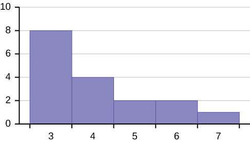
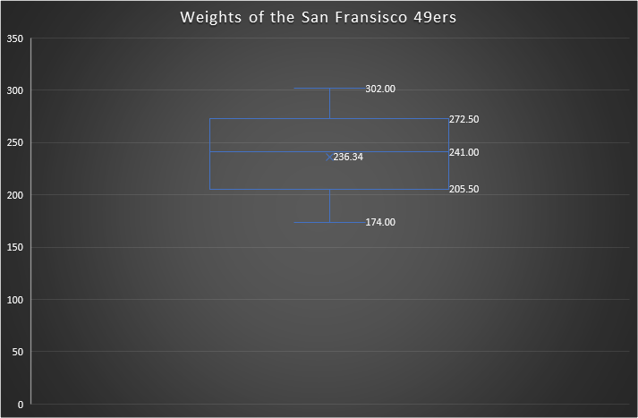

# Skyler MacDougall

## Homework 1: Due Friday 5/22/2020

### STAT-145-02

#### Section 2.3, Try It 2.14

Find the Interquartile Range for the following two data sets, and compare them.

Test Scores for Class *A* 

69; 96; 81; 79; 65; 76; 83; 99; 89; 67; 90; 77; 85; 98; 66; 91; 77; 69; 80; 94

Test Scores for Class *B* 

90; 72; 80; 92; 90; 97; 92; 75; 79; 68; 70; 80; 99; 95; 78; 73; 71; 68; 95; 100

The interquartile range for class A is 16, while the interquartile range for class B is 20. This means that the scores for class A are more consistent.

#### Practice Problems

52.  When the data are skewed left, what is the typical relationship between the mean and median?
     In general, skewed left data tends to mean that the mean is less than the median.
53.  When the data are symmetrical, what is the typical relationship between the mean and median?
     In general, symmetrical data tends to mean that the mean is the same as the median.

54.  What word describes a distribution that has two modes?
     The word that describes a distribution that has two modes is bimodal. The general term for this is multimodal.
55.  Describe the shape of this distribution.
     
     This distribution is skewed left. 

#### Homework Problems

88.  Given the following box plots, answer the questions:
     ![This shows two boxplots graphed over number lines from 0 to 7. The first whisker in the data 1 boxplot extends from 0 to 2. The box begins at the firs quartile, 2, and ends at the third quartile, 5. A vertical, dashed line marks the median at 4. The second whisker extends from the third quartile to the largest value, 7. The first whisker in the data 2 box plot extends from 0 to 1.3. The box begins at the first quartile, 1.3, and ends at the third quartile, 2.5. A vertical, dashed line marks the medial at 2. The second whisker extends from the third quartile to the largest value, 7.](Untitled.assets/20d2a9d5bcb2088a1079046ac5384f2507b3103f.jpg)

     1.  In complete sentences, explain why each statement is false.

         1.  **Data 1** has more data values above 2 than **Data 2** has above two.

             There's actually no way to know how much data there is, from either of these graphs, simply the distribution of data.

         2.  The data sets cannot have the same mode.

             The boxes, which contain the majority of the data, overlap. This, combined with the fact that discrete data points are not shown, means that we have no way of knowing where exactly the mean is, only that it is somewhere within the box. And, because we have no idea where the mean is within the box, it could be that the mean is in the overlapping region of the boxes.

         3.  For **Data 1**, there is more data values before than there are above four.

             As with the previous statement, because of the lack of discrete data points, we have no way of knowing exactly what is where. The part of the box above 4 could be very dense, with the part between 2 and 4 being sparse.

     2.  For which group, Data 1 or Data 2, is the value of "7" more likely to be an outlier? Explain why in complete sentences.

         7 is more likely to be an outlier in Data 2, because the box is smaller than in Data 1, meaning that the majority of the data is within a smaller range.

115.  Following are the published weights (in pounds) of all of the team members of the San Francisco 49ers from a previous year.

      177;  205;  210;  210;  232;  205;  185;  185;  178;  210;  206;  212;  184;  174;  185;  242;  188;  212;  215;  247;  241;  223;  220;  260;  245;  259;  278;  270;  280;  295;  275;  285;  290;  272;  273;  280;  285;  286;  200;  215;  185;  230;  250;  241;  190;  260;  250;  302;  265;  290;  276;  228;  265

      1.  Organize the data from smallest to largest value.
      
          In order, from smallest to largest, from left to right, then top to bottom
          174,	177,	178,	184,	185,	185,	185,	185,	188,	190,	200,	205,	205,	206,	210,	210,	210,	212,	212,	215,	215,	220,	223,	228,	230,	232,	241,	241,	242,	245,	247,	250,	250,	259,	260,	260,	265,	265,	270,	272,	273,	275,	276,	278,	280,	280,	285,	285,	286,	290,	290,	295,	302
      2.  Find the median.
          241
      
      3.  Find the first quartile.
          205.5
      
      4.  Find the third quartile.
          272.5
      
      5.  Construct a box plot of the data.
          
      
      6.  The middle 50% of the weights are from __ 205.5 __ to __ 272.5 __.
      
      7.  If our population were all professional football players, would the  above data be a sample of weights or the population of weights?  Why?
          The above would be a sample of weights. Samples are smaller than populations.
      
      8.  If our population included every team member who ever played for the San Francisco 49ers, would the above data be a sample of weights or the population of weights?  Why?
          As with the previous question, this would be a sample, because samples are smaller than populations. 