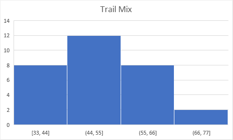
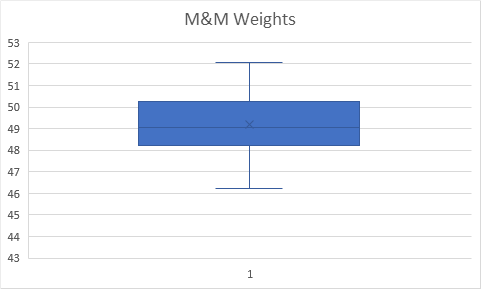
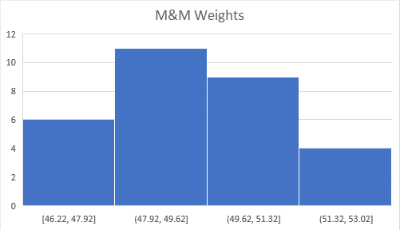
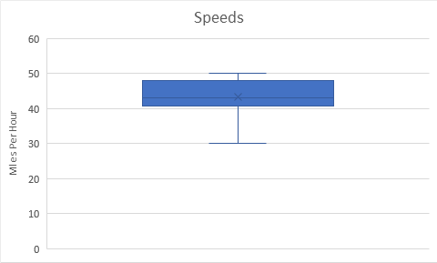

# Question 1

Typically, there are between 44-55 candies in each 26 oz. bag of trail mix.

# Question 8

## M&M Weights

1.   Using  technology, calculate the mean and median weights for the sample. Show  the output and clearly state your answers. Round to 3 decimal places.
    $$
    Mean = 49.070\\
    Median=49.192
    $$

2.  Using  technology, produce a histogram of the weights of bags of M&Ms.  Paste this image into the document. Using the histogram, describe the  shape of the distribution of weights.
    

3.   Using  technology, produce a modified box plot of the weights of bags of  M&Ms. Paste this image into the document. Using the box plot,  indicate if there are any outliers.
    

4.  Is the mean an adequate measure of a typical weight for this sample? Explain why or why not.

Yes, because the data is relatively symmetrical.

# Question 11

## Highway Patrol Speeds

1.  On a separate document, state the 5-number summary and the mean speed.
    $$
    Min=30\\
    Q1=41\\
    Median=43\\
    Q3=48\\
    Max=50\\
    $$
    

2.   On a separate document, show lower and upper fences and explain the meaning of these values.
    $$
    Upper\ Fence = 30.5\\
    Lower\ Fence = 51.5
    $$
    This means that all information is within error.

3.   On a separate document, show the modified box plot (build it with statistical technology).
    

# Question 12

## 2019 Cars

1.  On a separate document, describe the shape of the distributions of MPG for the Fiesta and Yaris.
    The distributions are relatively symmetrical.
2.   On a separate document, compare the center/typical MPG for the  Fiesta and Yaris. Do not report the values, compare with terms like  'greater than, less than, etc.'
    The Fiesta has a lower typical and center than the Yaris.