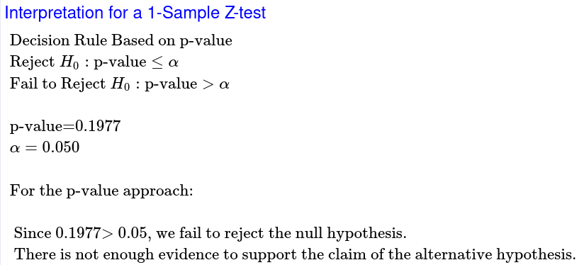
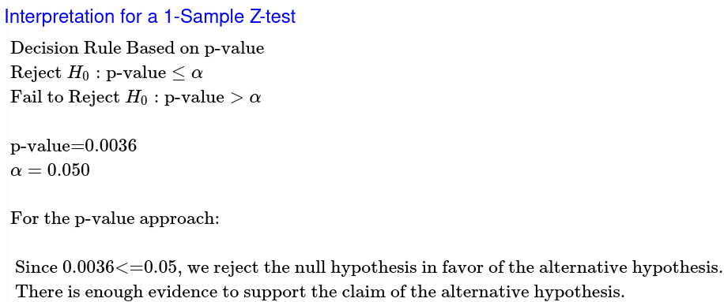

# 	Skyler MacDougall

## Homework 9: Due Friday 7/24/2020

### STAT-145-02

63. Over the past few decades, public health officials  have examined the link between weight concerns and teen girls' smoking.  Researchers surveyed a group of 273 randomly selected teen girls living  in Massachusetts (between 12 and 15 years old). After four years the  girls were surveyed again. Sixty-three said they smoked to stay thin. Is there good evidence that more than thirty percent of the teen girls  smoke to stay thin? The alternative hypothesis is:
    1. *p* < 0.30
    2. *p* ≤ 0.30 
    3. *p* ≥ 0.30 
    4. ==*p* > 0.30==

64. A statistics instructor believes that fewer  than 20% of Evergreen Valley College (EVC) students attended the opening night midnight showing of the latest Harry Potter movie. She surveys 84 of her students and finds that 11 attended the midnight showing. An  appropriate alternative hypothesis is:
    1. *p* = 0.20
    2. *p* > 0.20
    3. ==*p* < 0.20==
    4. *p* ≤ 0.20

68. When a new drug is created, the pharmaceutical company must subject it to testing before receiving the necessary permission  from the Food and Drug Administration (FDA) to market the drug. Suppose  the null hypothesis is “the drug is unsafe.” What is the Type II Error?
    1. To conclude the drug is safe when in, fact, it is unsafe.
    2. Not to conclude the drug is safe when, in fact, it is safe.
    3. To conclude the drug is safe when, in fact, it is safe.
    4. ==Not to conclude the drug is unsafe when, in fact, it is unsafe.==

69. A statistics instructor believes that fewer than  20% of Evergreen Valley College (EVC) students attended the opening  midnight showing of the latest Harry Potter movie. She surveys 84 of her students and finds that 11 of them attended the midnight showing. The  Type I error is to conclude that the percent of EVC students who  attended is ________.
    1. at least 20%, when in fact, it is less than 20%.
    2. 20%, when in fact, it is 20%.
    3. ==less than 20%, when in fact, it is at least 20%.==
    4. less than 20%, when in fact, it is less than 20%.

73. The National Institute of Mental Health published an article stating  that in any one-year period, approximately 9.5 percent of American  adults suffer from depression or a depressive illness. Suppose that in a survey of 100 people in a certain town, seven of them suffered from  depression or a depressive illness. Conduct a hypothesis test to  determine if the true proportion of people in that town suffering from  depression or a depressive illness is lower than the percent in the  general adult American population.
    (**Show the complete testing process as taught in notes.**)

#### Population

We are studying the percentage of American adults that suffer from depression or a depressive illness in any one-year period.

p= the true proportion of American adults that suffer from depression or a depressive illness.

Goal: Test to see if there is support for saying that p has decreased from 9.5% of the American adult population.

#### Method

$$
H_0:p=0.095\\
H_a:p<0.095\\
\alpha=0.05\\
$$

#### Sample

$$
n(p_0)(1-p_0)\ge10\\
100(0.095)(0.905)\ge10\\
8.5975\cancel \ge 10\\
\therefore\\
The\ sample\ cannot\ be\\
considered\ normal
$$

#### Results

$$
Z=\frac{\hat{p}-p_0}{\sqrt{\frac{(p_0)(1-p_0)}{n}}}\\
Z=\frac{0.07-0.095}{\sqrt{\frac{(0.095)(1-0.095)}{100}}}\\
Z=\frac{-0.025}{\sqrt{\frac{(0.095)(0.905)}{100}}}\\
Z=\frac{-0.025}{\sqrt{\frac{0.086}{100}}}\\
Z=-0.85
$$

My sample mean is 0.85 standard errors below 9.5%.

My p-value is 0.1977.

Assuming that the true proportion equals 9.5%, there is a 19.77% probability of getting a sample population ($\hat p$) at least as extreme as the one we got from sampling.

#### Conclusion

At the 5% level of significance, the sample data does not provide sufficient evidence to say that the true proportion has decreased from 9.5% of American adults in a one year period who suffer from depression or a depressive illness.

85. A poll done for *Newsweek* found that 13%  of Americans have seen or sensed the presence of an angel. A contingent  doubts that the percent is really that high. It conducts its own survey. Out of 76 Americans surveyed, only two had seen or sensed the presence  of an angel. As a result of the contingent’s survey, would you agree  with the *Newsweek* poll? In complete sentences, also give three reasons why the two polls might give different results.  
    (**Show the complete testing process as taught in notes.**)

One reason why the two polls might give different results is the selected population, which either one or both of said polls could have been biased toward the intended result. Another reason could be the relatively small sample size. A third reason could be that the polls could have been held in different locations, which would naturally have differing levels of religious ties, and as such have differing amounts of individuals who have seen or sensed the presence of an angel.

#### Population

We are studying the percentage of Americans who have seen or sensed the presence of an angel.

p= the true proportion of Americans who have seen or sensed the presence of an angel.

Goal: Test to see if there is support for saying that p has decreased from 13% of the American population.

#### Method

$$
H_0:p=0.13\\
H_a:p<0.13\\
\alpha=0.05\\
$$

#### Sample

$$
n(p_0)(1-p_0)\ge10\\
76(0.13)(0.87)\ge10\\
8.4825\cancel \ge 10\\
\therefore\\
The\ sample\ cannot\ be\\
considered\ normal
$$

#### Results

$$
Z=\frac{\hat{p}-p_0}{\sqrt{\frac{(p_0)(1-p_0)}{n}}}\\
Z=\frac{0.0263-0.13}{\sqrt{\frac{(0.13)(1-0.13)}{100}}}\\
Z=\frac{-0.1037}{\sqrt{\frac{(0.13)(0.87)}{100}}}\\
Z=\frac{-0.1037}{\sqrt{\frac{0.1131}{100}}}\\
Z=-2.69
$$

My sample mean is 2.69 standard errors below 13%.

My p-value is 0.0036.

Assuming that the true proportion equals 13%, there is a 0.36% probability of getting a sample population ($\hat p$) at least as extreme as the one we got from sampling.

#### Conclusion

At the 5% level of significance, the sample data does provide sufficient evidence to say that the true proportion has decreased from 13% of Americans who have seen or sensed the presence of an angel.

