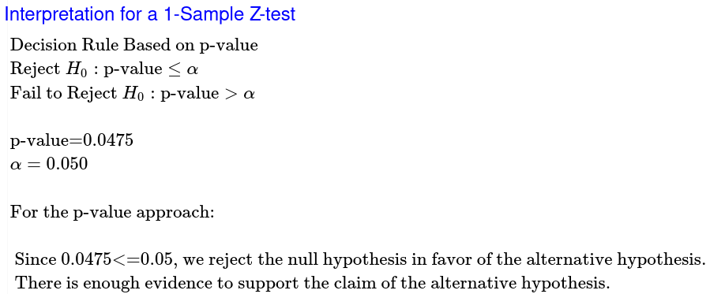
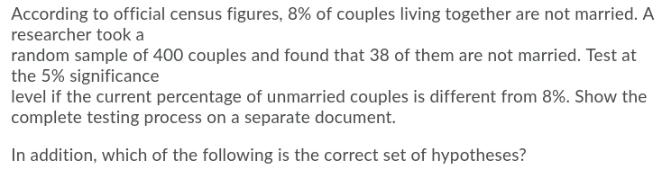
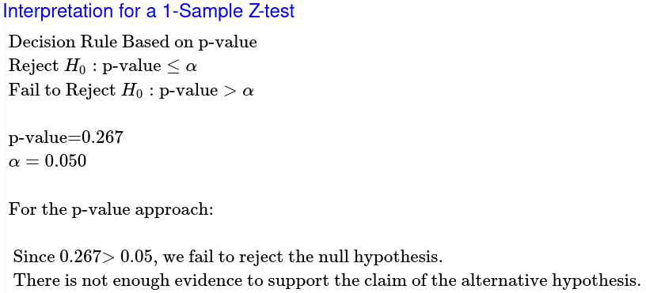

# Question 8

## Basketball

#### Population

We are studying the percentage successful free throw attempts made by Saquille O'Neal.

p= the true proportion of successful free throw attempts made by Shaquille O'Neal.

Goal: Test to see if there is support for saying that p has increased from 53.3% of his free throw attempts.

#### Method

$$
H_0:p=0.533\\
H_a:p>0.533\\
\alpha=0.05\\
$$

#### Sample

$$
n(p_0)(1-p_0)\ge10\\
36(0.533)(0.467)\ge10\\
8.960796\cancel \ge 10\\
\therefore\\
The\ sample\ cannot\ be\\
considered\ normal
$$

#### Results

$$
Z=\frac{\hat{p}-p_0}{\sqrt{\frac{(p_0)(1-p_0)}{n}}}\\
Z=\frac{0.6667-0.533}{\sqrt{\frac{(0.533)(1-0.533)}{100}}}\\
Z=\frac{0.1337}{\sqrt{\frac{(0.533)(0.467)}{100}}}\\
Z=\frac{0.1337}{\sqrt{\frac{0.2489}{100}}}\\
Z=1.67
$$

My sample mean is 0.67 standard errors above 53.3%.

My p-value is 0.0475.

Assuming that the true proportion equals 53.3%, there is a 4.75% probability of getting a sample population ($\hat p$) at least as extreme as the one we got from sampling.

#### Conclusion

At the 5% level of significance, the sample data does provide sufficient evidence to say that the true proportion has increased from 53.3% success rate of Shaquille O'Neal's freethrow attempts.

# Question 9

## Couples

#### Population

We are studying the percentage of couples living together who are not married.

p= the true proportion of couples living together who are not married.

Goal: Test to see if there is support for saying that p has changed from 8%.

#### Method

$$
H_0:p=0.08\\
H_a:p\ne0.08\\
\alpha=0.05\\
$$

#### Sample

$$
n(p_0)(1-p_0)\ge10\\
400(0.08)(0.92)\ge10\\
29.44 \ge 10\\
\therefore\\
The\ sample\ can\ be\\
considered\ normal
$$

#### Results

$$
Z=\frac{\hat{p}-p_0}{\sqrt{\frac{(p_0)(1-p_0)}{n}}}\\
Z=\frac{0.095-0.08}{\sqrt{\frac{(0.08)(1-0.08)}{100}}}\\
Z=\frac{0.015}{\sqrt{\frac{(0.13)(0.87)}{100}}}\\
Z=\frac{0.015}{\sqrt{\frac{0.0736}{100}}}\\
Z=1.11
$$

My sample mean is 1.11 standard errors above 8%.

My p-value is 0.267.

Assuming that the true proportion equals 8%, there is a 26.7% probability of getting a sample population ($\hat p$) at least as extreme as the one we got from sampling.

#### Conclusion

At the 5% level of significance, the sample data does not provide sufficient evidence to say that the true proportion has changed from 8% of couples living together who are not married.

