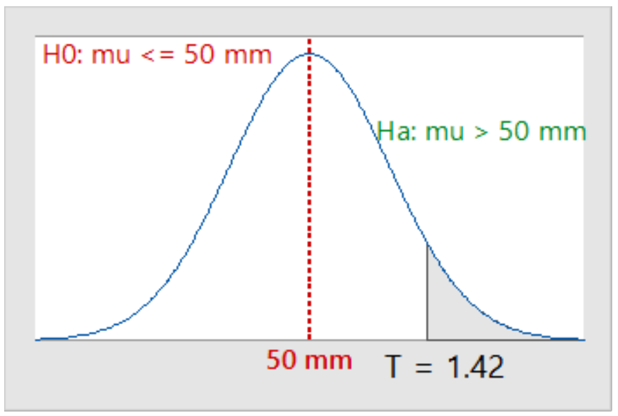
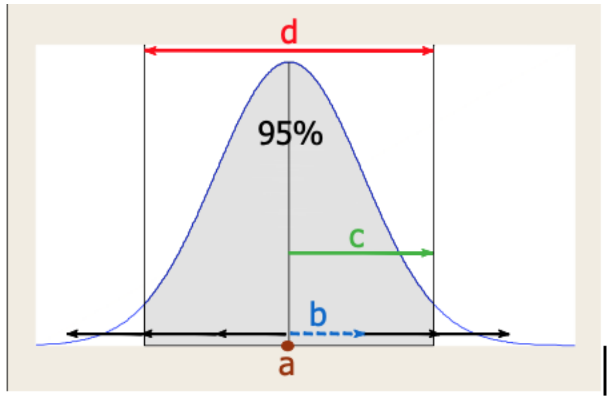

# 	Skyler MacDougall

## Homework 11: Due Friday 7/24/2020

### STAT-145-02

#### Part A: Multiple Choice

1. School district officials believe that students spend plenty of time reading at home. A teacher wants to convince these officials that, on average, students spend less than 90 minutes per week reading at home.
    **What is the alternative hypothesis?**

    1. $\cancel{H_a: p<0.9}$
    2. $\cancel{H_a: p>0.9}$
    3. $\cancel{H_a: \mu>90}$
    4. $\underline{\overline{|H_a: \mu<90|}}$

2. Which statement provides a correct interpretation of the value of T test statistic?
    

    1. ==My $\overline X$ is 1.42 standard errors above 50.==
    2. ~~My $\overline X$ is 1.42 mm above 50.~~
    3. ~~My $\overline X$ is 1.42 times as large as 50.~~
    4. ~~My $\overline X$ equals 1.42mm.~~

3. When the probability value is "small" in a test of hypotheses, this tells us that our sample mean is __. 

    1. ~~Unusual for the curve.~~
    2. ==typical for the curve.==
    3. ~~computed incorrectly.~~
    4. ~~below the center of the curve.~~

4. If your sample has sufficient evidence to reject $H_0$, there is a small chance that a __ occurred.

    1. ~~large probability value~~
    2. ==Type I error==
    3. ~~Type II error~~
    4. ~~correct decision~~

5. When testing the hypotheses
    $$
    H_0:p=0.6\\
    H_a:p>0.6
    $$
    you check that the normal is appropriate by showing that:

    1. $\cancel{p\ge10}$
    2. ~~you have a random sample~~
    3. $\cancel{n\ge30\ OR\ NPP\ p-value>0.05}$
    4. $\underline{\overline{|n(0.6)(1-0.6)\ge10|}}$

6. Researchers will create a confidence interval with the proportion of all first-grade children who are overweight. The chance that this method will provide a correct result is determined by the:

    1. sample size
    2. level of confidence
    3. sample mean
    4. population standard deviation

7. See the confidence interval diagram below.
    
    The margin of error is represented by:

    1. ~~The dot labelled "a".~~
    2. ~~the dashed arrow labelled "b".~~
    3. ==the arrow labelled "c".==
    4. ~~the double arrow labelled "d".~~

8. A 95% confidence interval for the average speed of drivers on the New York State Thruway is (65mph, 75mph). What is the value of his point estimate?

    1. ~~65 mph~~
    2. ~~5 mph~~
    3. ~~10 mph~~
    4. ==70 mph==

9. When creating a confidence interval for a numerical variable, you check that the "t-curve" is appropriate to use by showing that

    1. ~~you have a random sample~~
    2. $\underline{\overline{|n\ge30\ OR\ NPP\ p-value>0.05|}}$
    3. $\cancel{n\ge10}$
    4. $\cancel{n(p)(1-p)\ge10}$

10. A 95% confidence interval for the percentage of all Rochester area drivers who text while driving is (35%, 43%). Which statement is reasonable based on the CI result?

    1. ==The percentage of Rochester area drivers who text while driving is equal to 37%==
    2. ~~The percentage of Rochester area drivers who text while driving is equal to 34%~~
    3. ~~The percentage of Rochester area drivers who text while driving is equal to 30%~~
    4. ~~The percentage of Rochester area drivers who text while driving is equal to 48%~~

11. Based on a random sample of 50 full-time college students, we can be 90% confident that for all college students the mean time spent studying per week is between 9.25 hours and 10.75 hours.
    Which of the following intervals is a reasonable 95% confidence interval for this sample?

    1. ==(9.10, 10.90)==
    2. ~~(9.30, 10.70)~~
    3. ~~(9.45, 10.55)~~
    4. ~~(9.00, 10.50)~~

12. If you want to estimate the proportion of all RIT students who smoke within 0.05 with 90% confidence, what is the minimum sample size you will need?

    1. 1562
    2. 2033
    3. 271
    4. 549

13. We are 95% confident that during October 2016 the mean water usage for all Rochester households was between 1250 and 1350 cubic feet.
    In which statement can you have 95% confidence?

    1. ~~Mean water usage is greater than 1300 cubic feet.~~
    2. ==Mean water usage is less than 1400 cubic feet.==
    3. ~~Mean water usage is between 1200 and 1300 cubic feet.~~
    4. ~~Mean water usage is less than 1300 cubic feet.~~

#### Part B: Test and CI

14. It is commonly thought that very few US adults believe in reincarnation (the rebirth of a soul into a new body). But a researcher thinks that group has been growing and wants to convince others that the percentage who believe in reincarnation is grater than 20%. In the researcher's random sample of 942 US adults, 195 stated that they believe in reincarnation. Does the researcher's sample provide sufficient evidence to support the idea that more than 20% of all US adults believe in reincarnation? Show the complete testing process and always include your statistical output.

    #### Population

    We are studying the percentage of US adults who believe in reincarnation.

    p= the true proportion of US adults who believe in reincarnation.

    Goal: Test to see if there is support for saying that p has increased from 20% of the American population.

    #### Method

    $$
    H_0:p=0.20\\
    H_a:p>0.20\\
    \alpha=0.05\\
    $$

    #### Sample

    
    $$
    n(p_0)(1-p_0)\ge10\\
    942(0.207)(0.793)\ge10\\
    154.63\ge 10\\
    \therefore\\
    The\ sample\ can\ be\\
    considered\ normal
    $$

    #### Results

    $$
    Z=\frac{\hat{p}-p_0}{\sqrt{\frac{(p_0)(1-p_0)}{n}}}\\
    Z=\frac{0.20-0.207}{\sqrt{\frac{(0.207)(1-0.207)}{942}}}\\
    Z=\frac{-0.007}{\sqrt{\frac{(0.207)(0.793)}{942}}}\\
    Z=\frac{-0.007}{\sqrt{\frac{0.164}{942}}}\\
    Z=-0.53
    $$

    My sample mean is 0.53 standard errors below 20%.

    

    My p-value is .

    Assuming that the true proportion equals 20%, there is a % probability of getting a sample population ($\hat p$) at least as extreme as the one we got from sampling.

    #### Conclusion

    At the 5% level of significance, the sample data does not provide sufficient evidence to say that the true proportion has increased from 20% of US adults who believe in reincarnation.

    

    

15. How much caffeine is in *King of Caffeine* cola? A dozen randomly selected cans of *King of Caffeine* cola had the values of caffeine, measured in mg, noted in the provided excel sheet.

    1. Estimate the mean caffeine level among all cans of *King of Caffeine* cola with a 95% confidence.
        
    2. What minimum sample size would be needed to estimate the mean caffeine level within 0.4mg with 95% confidence? **Show your work.**
        