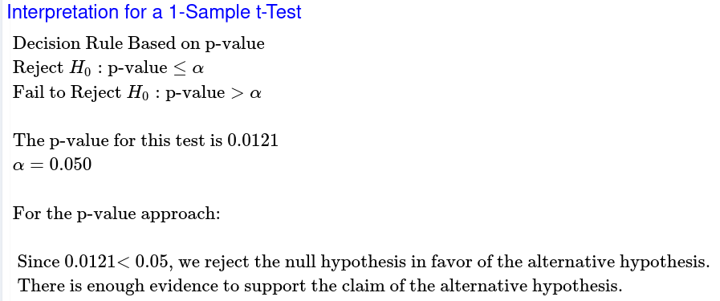
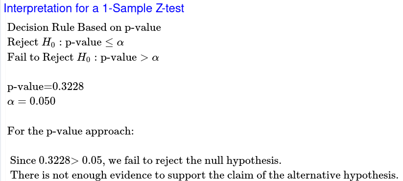

# Question 25

## Pizzas

#### Population

We are studying the amount of time, in minutes, between order and delivery of a pizza to college dormitories.

$\mu$ = true mean time between order and delivery of a pizza to college dormitories.

Goal: Test to see if there is support for saying that $\mu$ has decreased from 25 minutes.

#### Method

$$
H_0:\mu=25\\
H_a:\mu<25\\
\alpha=0.05\\
T-curve\ with\ df=30
$$

#### Sample

$$
n>30\\
\therefore\\
The\ sample\ can\ be\\
considered\ normal
$$

#### Results

$$
t=\frac{\overline x-u_0}{s\div\sqrt n}\ with\ df=n-1\\
t=\frac{22.4-25}{\frac{6.1}{\sqrt{31}}}\ with\ df=31-1\\
t=\frac{-2.6}{\frac{10}{\sqrt{31}}}\ with\ df=30\\
t=-2.373\ with\ df=30
$$

My sample mean is 2.373 standard errors below 25.

My p-value is 0.0121.

Assuming that the true mean equals 25, there is a 1.21% probability of getting a sample mean ($\overline x$) at least as extreme as the one we got from sampling.

#### Conclusion

At the 5% level of significance, the sample data does provide sufficient evidence to say that the true mean has decreased from 25 minutes between the order and the delivery of a pizza to college dormitories.

# Question 26

## Lactose

#### Population

We are studying the percentage of Americans who have trouble digesting milk.

p= the true proportion of Americans that have trouble digesting milk.

Goal: Test to see if there is support for saying that p has increased from 35% of the American population.

#### Method

$$
H_0:p=0.35\\
H_a:p<0.35\\
\alpha=0.05\\
$$

#### Sample

$$
n(p_0)(1-p_0)\ge10\\
250(0.35)(0.65)\ge10\\
56.875\cancel \ge 10\\
\therefore\\
The\ sample\ can\ be\\
considered\ normal
$$

#### Results

$$
Z=\frac{\hat{p}-p_0}{\sqrt{\frac{(p_0)(1-p_0)}{n}}}\\
Z=\frac{0.364-0.35}{\sqrt{\frac{(0.35)(1-0.35)}{250}}}\\
Z=\frac{0.014}{\sqrt{\frac{(0.35)(0.65)}{250}}}\\
Z=\frac{0.014}{\sqrt{\frac{0.2275}{250}}}\\
Z=0.46
$$

My sample mean is 0.46 standard errors below 35%.

My p-value is 0.3228.

Assuming that the true proportion equals 35%, there is a 32.28% probability of getting a sample population ($\hat p$) at least as extreme as the one we got from sampling.

#### Conclusion

At the 5% level of significance, the sample data does not provide sufficient evidence to say that the true proportion has increased from 35% of Americans having trouble digesting regular milk.
