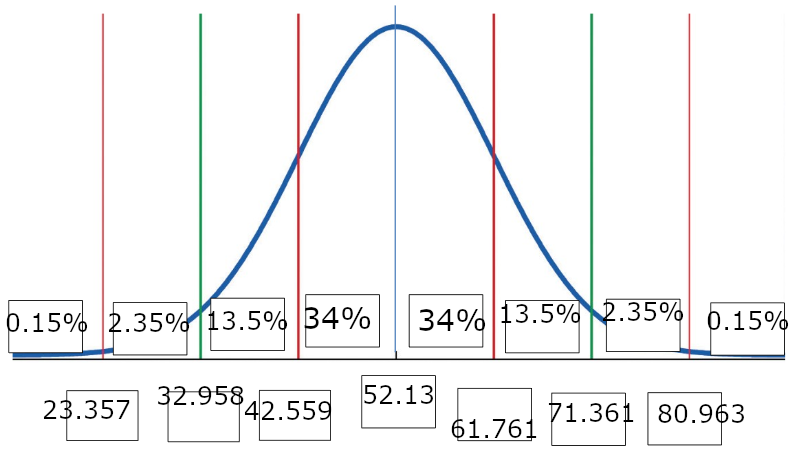
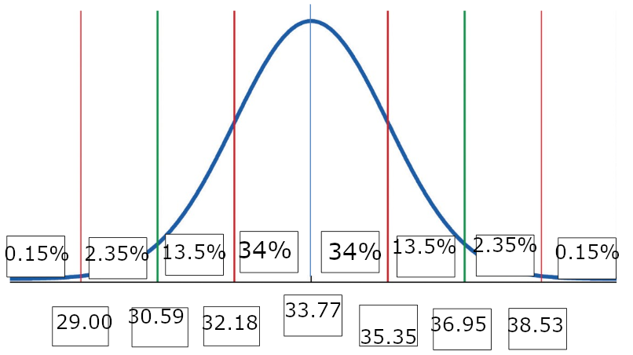
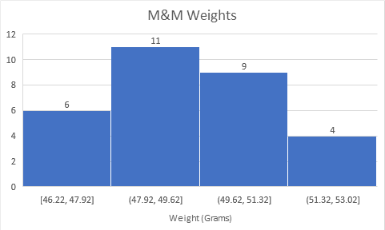
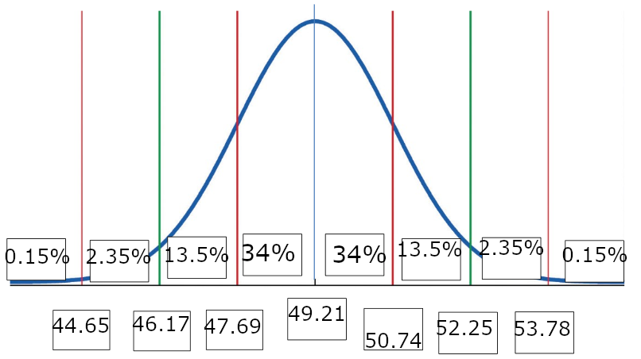

# Question 3

## Trail Mix

1.  Using technology, calculate the mean and standard deviation for these data. Paste the output on the document.
    $$
    Mean=52.1\overline3\\
    \sigma=9.601
    $$

2.  Construct a Bell-shaped curve, and label the empirical rule intervals.
    

3.  The 16th percentile shows that 16% of the bags of 26 oz trail mix contain more than 61.761 candies.

# Question 7

## Basketball players

1.  Calculate the mean and standard deviation for their heights (round to two decimal places).
    $$
    Mean=192.5\\
    \sigma=2.67
    $$
    

2.  John is 190cm tall. Express his height as a z-score compared with the basketball players heights. Interpret the z-score in a complete sentence.
    John's height has a z-score of  -0.935, which means he is 0.935 standard deviations shorter than the mean basketball player in the list.

3.  Bills height, when compared to the basketball players has a z-score of -1.0. Calculate bills height.
    $$
    Z={x-\overline x\over\sigma}\\
    -1={x-\overline 192.5\over2.67}\\
    -2.67=x-192.5\\
    x=189.8
    $$
    Bill is approximately 189cm tall.

# Question 8

## Cars

1.  Using technology, calculate the sample mean and the standard deviation for both cars. Round your answer to 2 decimal places. 
    $$
    Mean_{Yaris}=33.77\\
    Mean_{Fiesta}=29.69\\
    \sigma_{Yaris}=1.59\\
    \sigma_{Fiesta}=1.31
    $$

2.  Your sister owns a 2019 Toyota Yaris that regularly gets 36MPG. Determine if the miles per gallon that your sister's car achieves is unusual. Show work and explain how you came to that decision.
    $$
    z={x-\overline x\over \sigma}\\
    z={36-33.77\over1.59}\\
    z=1.40
    $$
    An MPG of 36 is 1.4 standard deviations away from the mean, meaning that it is not unusual. Statistically unusual is a value 3 or more standard deviations away from the mean.

3.  You own a 2019 Yaris that regularly gets 39MPG. Determine if the miles per gallon you get is considered unusual. Show work and explain how you came to that decision.
    $$
    z={x-\overline x\over \sigma}\\
    z={36-33.77\over1.59}\\
    z=3.29
    $$
    A MPG of 39 is 3.29 standard deviations away from the mean, meaning that it is unusual.

4.  Assuming normal/symmetric distribution for the Yaris MPG data, show the empirical rule intervals/percentages on a document.
    

    

# Question 9

## M&M Weights

1.  Use technology to construct a histogram of these data. Can the shape of the histogram be described as somewhat symmetric or "bell-shaped"?
    
    The histogram cannot be described as bell-shaped. It is skewed left.

2.  Use technology to find the sample mean and sample standard deviation.
    $$
    Mean=49.215\\
    \sigma=1.522
    $$

3.  

4.  According to the empirical rule, about 68% of the plain M&M bag weights are between _ 47.69 _ and _ 50.74 _.

5.  About 100% of the plain M&M weights are between 46.171 grams and 52.259 grams.

6.  What bag weight represents the 16th percentile?
    50.74 grams of M&Ms is the 16th percentile, because 16% of the data is greater than that.

7.  What bag weight represents the 84th percentile?

    47.69 grams of M&Ms is the 84th percentile, because 84% of the data is greater than that.

8.  State the weight of the bag such that 2.5% of all bags in the sample are higher than this bag.
    52.25grams.

# Question 11

1.  Describe the shape of the two distributions, compare the centers of the two distributions, and compare the spreads of the two distributions. Don't state the center and spread, but compare them.
    The Pittsburgh distribution is much wider than the San Francisco distribution, but they are centered around roughly the same point.
2.  For which city is the median temperature more believable? Justify with a statistical reason.
    Statistically, the smaller spread of the San Francisco data suggests it is more believable.

# Question 12

## Work Hours

![img](data:image/png;base64,iVBORw0KGgoAAAANSUhEUgAABGUAAAM5CAMAAACZ33xuAAAC8VBMVEUAAAABAQECAgIDAwMEBAQFBQUGBgYHBwcICAgJCQkKCgoLCwsMDAwNDQ0ODg4PDw8QEBARERESEhITExMUFBQVFRUWFhYXFxcYGBgZGRkaGhobGxscHBwdHR0eHh4fHx8gICAhISEiIiIjIyMkJCQlJSUmJiYnJycoKCgpKSkqKiorKyssLCwtLS0uLi4vLy8wMDAxMTEyMjIzMzM0NDQ1NTU2NjY3Nzc4ODg5OTk6Ojo7Ozs8PDw9PT0+Pj4/Pz9AQEBBQUFCQkJDQ0NERERFRUVGRkZHR0dISEhJSUlKSkpLS0tMTExNTU1OTk5PT09QUFBRUVFSUlJTU1NUVFRVVVVWVlZXV1dYWFhZWVlaWlpbW1tcXFxdXV1eXl5fX19gYGBiYmJjY2NlZWVmZmZnZ2dpaWlqampra2tsbGxtbW1ubm5wcHBxcXFycnJzc3N0dHR1dXV2dnZ3d3d4eHh5eXl6enp7e3t8fHx9fX1+fn5/f3+AgICBgYGCgoKDg4OEhISFhYWGhoaHh4eIiIiJiYmKioqLi4uMjIyNjY2Ojo6Pj4+QkJCRkZGSkpKTk5OUlJSVlZWWlpaXl5eYmJiZmZmampqbm5udnZ2enp6fn5+goKChoaGioqKjo6OkpKSlpaWmpqanp6eoqKipqamqqqqrq6usrKytra2urq6vr6+wsLCxsbGysrKzs7O0tLS1tbW2tra3t7e4uLi5ubm6urq7u7u8vLy9vb2+vr6/v7/AwMDBwcHCwsLDw8PExMTFxcXGxsbHx8fIyMjJycnKysrLy8vMzMzNzc3Ozs7Pz8/Q0NDR0dHS0tLT09PU1NTV1dXW1tbX19fY2NjZ2dna2trb29vc3Nzd3d3e3t7f39/g4ODh4eHi4uLj4+Pk5OTl5eXm5ubn5+fo6Ojp6enq6urr6+vs7Ozt7e3u7u7v7+/w8PDx8fHy8vLz8/P09PT19fX29vb39/f4+Pj5+fn6+vr7+/v8/Pz9/f3+/v7///+JZUknAAAACXBIWXMAABCbAAAQmwF0iZxLAAAgAElEQVR4nO3de5hdZX3o8TcBEu4Q0EAQMbRCUFDw2EogTSmF1uMp4QhqU+op1rsV0lMPFhRbQcEiCCjWC6JSDngNYjEo5RKraAkgisWUgIDWCpgTIWgIuez119mXyWRW2DOPs7N+s1be+Xyex1nv3vud8M6axTezZ708pgIgUqp7AUDmVAaIpTJALJUBYqkMEEtlgFgqA8RSGSCWygCxVAaIpTJALJUBYqkMEEtlgFgqA8RSGSCWygCxVAaIpTJALJUBYqkMEEtlgFgqA8RSGSCWygCxVAaIpTJALJUBYqkMEEtlgFgqA8RSGSCWygCxVAaIpTJALJUBYqkMEEtlgFgqA8RSGSCWygCxVAaIpTJALJUBYqkMEEtlgFgqA8RSGSCWygCxVAaIpTJALJUBYqkMEEtlgFgqA8RSGSCWygCxVAaIpTJALJUBYqkMEEtlgFgqA8RSGSCWygCxVAaIpTJALJUBYqkMEEtlgFgqA8RSGSCWygCxVAaIpTJALJUBYqkMEEtlgFgqA8RSGSCWygCxVAaIpTJALJUBYqkMEEtlgFgqA8RSGSCWygCxVAaIpTJALJUBYqkMEEtlgFgqA8RSGSCWygCxVAaIpTJALJUBYqkMEEtlgFgqA8RSGSCWygCxVAaIlUVlFqSeJZ0Htxy36+xT7qx7ScAmWVTm0LRH143t8dVT0ux907Slda8JGJJDZVo7HTY8XjUjXdPaeH6as67GBQEj5FCZn6dXDo8vS6e2P7bm9949AfXLoTLfSu8YHi9IizuHC9NptS0HKMmhMp9NH/7oa//0/Ac648PTys5hWTqp3jUBm+RQmb9LO3XuMO16ZXs8c2qr89RD6aiaFwUMyaEyp6aZX1553zunbH9vsW7KXt2nVqcDR0w4Jw275AePF2t+eF9RPHyPgcHw4J5r29fG91+eDr17ceMGU2+r//w8YzAuOVTmk2fc1zmckV7Vrst+3afWphkjJjz5wLCjFrd/1nl6fVFseNrAYPOgc3Hc3/nf/RUM3v3yav6cocGaBpyfZwzGI4fKDHkkPbdoTd+lO340Hdx/0ku/OIErYpK68OS6V9AsGVWmmJHWFAek7kaZ5emY/nNUhngqU5ZBZVrrN/SOu+/eKo5M93bG16eF/SerDPFUpiyDyjyU5nTfJj6Q5hbF2enizvj0dHn/ySpDvG+NcvVNVhlUpjgkfa79ceMp6dKiWJEOW1MUj83aeXX/uSoDEy2Hynw57Xjm1z5zfHrR+vaDE9OCm6+bmxaNMldlYKLlUJniU7t3tsK8srvrd+X8znjh2lGmqgxMtCwqUzzx+fM/fc/QPfyNN11w0e2j3s9XGeJd+Vd1r6BZ8qjMb05liOceU5nKQNVUpkxloGoqU6YyUDWVKVMZqJpdeWUqA8RSGSCWygCxVAaqZldemcpA1dxjKlMZqJrKlKkMVE1lylQGqqYyZSoDVbMrr0xlgFgqA8RSGSCWykDV7MorUxmomntMZSoDVVOZMpWBqqlMmcpA1VSmTGWganbllakMEEtlgFgqA8RSGaiaXXllKgNVc4+pTGWgaipTpjJQNZUpUxmomsqUqQxUza68MpUBYqkMEEtlgFgqA1WzK69MZaBq7jGVqQxUTWXKVAaqpjJlKgNVU5kylYGq2ZVXpjJALJUBYqkMEEtloGp25ZWpDFTNPaYylYGqqUyZykDVVKZMZaBqKlOmMlA1u/LKVAaIpTJALJUBYqkMVM2uvDKVgaq5x1SmMlA1lSlTGaiaypSpDFRNZcpUBqpmV16ZygCxVAaIpTJALJWBqtmVV6YyUDX3mMpUBqqmMmUqA1VTmTKVgaqpTFk2lVk/d3pvcMtxu84+5c7RpqkM8ezKK8umMn+fepW5ekqavW+atnSUaSoDEy2Xyvzbdr3KrJqRrmltPD/NWdd/nsrARMukMr866Dk7ditzWTq1/bE1Py3pPzH3yqy64TPf21j3IqAkk8q8Od24R7cyC9LizuHCdFr/iXlXZuNZOz7/93afc0fd65js7Mory6MyX02nF73KHJ5Wdg7L0kn9Z+ZdmbOef2dRrD13jwfrXsgk5x5TWRaVeXTmC9cMVWbm1Fbn8FA6qv/UrCuzeqfevbU/f3vNC5nsVKYsh8q0Fmx/V9GrzLope3WfWp0OHDFh+ceHveJr64uNq1YXxa9X5Tf49qt7g2tPa8Z6Ju3gIyc3YhmRg3HJoTIfT+8vhiqzOu3XfWptmjFiwqeOH3bG0ieLtQ/+tCgeeTC/wbKP9ga3XNWM9UzawRUnN2IZkYNxyaAyK3aet6EYqkxr+i7d5x5NB/efnPU7phU7ru4eP3BCzQuZ7OzKK8ugMp9MB89rm5rmzft+cUDqbpRZno7pPznryhTHvrVzF/vH+3y57oXACFlUZti/FkemezvPXZ8W9p+cd2V+8sK5l131zj3eXfc6YKQMKjOkd4/p7HRx53B6GuVn1rwrU6z76MlHv+WuulcBJblVZkU6bE1RPDZr59X9Z2VeGRrBrryy3CpTnJgW3Hzd3LRolFkqQzz7Zcqyq8zK+Z1f0CxcO8oslSGeypTlU5lNNt50wUW3t0Z7VWWIpzJl+VVmbCpDPJUpUxmoml15ZSoDxFIZIJbKALFUBqpmV16ZykDV3GMqUxmomsqUqQxUTWXKVAaqpjJlKgNVsyuvTGWAWCoDxFIZIJbKQNXsyitTGaiae0xlKgNVU5kylYGqqUyZykDVVKZMZaBqduWVqQwQS2WAWCoDxFIZqJpdeWUqA1Vzj6lMZaBqKlOmMlA1lSlTGaiaypSpDFTNrrwylQFiqQwQS2WAWCoDVbMrr0xloGruMZWpDFRNZcpUBqqmMmUqA1VTmTKVgarZlVemMkAslQFiqQwQS2WganbllakMVM09pjKVgaqpTJnKQNVUpkxloGoqU6YyUDW78spUBoilMkAslQFiqQxUza68MpWBqrnHVKYyUDWVKVMZqJrKlKkMVE1lylQGqmZXXpnKALFUBoilMkAslYGq2ZVXpjJQNfeYylQGqqYyZSoDVVOZMpWBqqlMmcpA1ezKK1MZIJbKALFUBoiVRWWePvdluz3nj27qPbjluF1nn3LnaFNVhnh25ZXlUJn1c9PUI16Q0iWdB1dPSbP3TdOWjjJXZYjnHlNZDpX5WDr8saJYst2O/1UUq2aka1obz09z1vWfqzLEU5myHCpzXPr3zmFhurYoLkuntoet+WlJ/7mZV+aJD5087y03172KSU9lynKozP7Tu4cz08VFsSAt7owvTKf1n5t3ZR747XmXXfWuZ72j7nVMdipTlkNlfnhv93BC+kpRHJ5WdsbL0kn95+Zdmflva7U/PrTPtXUvZJKzK68sh8q0tZ768Rnp0KeLYubUzr9nxUPpqP4Ts67Mih1Xd48fOLHmhcBImVTmX1NK8x4pinVT9uo+Xp0OHPHq5S8d9s5vP1msvf8nRfHz+/Mb3PGJ3uCWLzVjPQb5DsYlk8rce/LRO6fXrWvXZb/u47VpxohX/+Pzw17x1fXFxsfbJ2nN4/kNvvU/e4Nr39iM9RjkOxiXTCrT9ui89L6iNX2X3oN0cP9ZWb9jWr3T3d3jqW+teSGTnV15ZflUpvhueklRHJC6G2WWp2P6T8q6MsV7D76t/TfN3+/9cN0LmeTcYyrLoDL3vPYj3ePjaf+iODJ1bzhdnxb2n5x3ZVof3P35v7f7Ud+vex2TncqUZVCZ5eml3eM96Q+K4uzOppmiOD2Nci8x78oUxaobPv29Vt2LmPRUpiyDymzcP327c3xD+tuiWJEOW1MUj83aeXX/yblXhiZQmbIMKlNclnY/92tXvzLt/3j7wYlpwc3XzU2LRpmrMsSzK68sh8q03r1dajv6h50HK+d3xgvXjjJXZWCi5VCZovj5Z8771Hc39sYbb7rgottH/dWEysBEy6MyvzmVgYmmMlA1u/LKVAaq5h5TmcpA1VSmTGWgaipTpjJQNZUpUxmoml15ZSoDxFIZIJbKALFUBqpmV16ZykDV3GMqUxmomsqUqQxUTWXKVAaqpjJlKgNVsyuvTGWAWCoDxFIZIJbKQNXsyitTGaiae0xlKgNVU5kylYGqqUyZykDVVKZMZaBqduWVqQwQS2WAWCoDxFIZqJpdeWUqA1Vzj6lMZaBqKlOmMlA1lSlTGaiaypSpDFTNrrwylQFiqQwQS2WAWCoDVbMrr0xloGruMZWpDFRNZcpUBqqmMmUqA1VTmTKVgarZlVemMkAslQFiqQwQS2WganbllakMVM09pjKVgaqpTJnKQNVUpkxloGoqU6YyUDW78spUBoilMkAslQFiqQxUza68MpWBqrnHVKYyUDWVKVMZqJrKlKkMVE1lylQGqmZXXpnKALFUBoilMkAslYGq2ZVXpjJQNfeYylQGqqYyZVlUpvWZeXvsMffDG7oPbjlu19mn3DnaVJUhnsqU5VCZ1utTet5Ltk/HdzJz9ZQ0e980bekoc1WGeCpTlkNlbki73Noq7js0XVgUq2aka1obz09z1vWfqzLEsyuvLIfKLEwf7hy+m36nKC5Lp7aHrflpSf+5KgMTLYfKHJHu6hw27jRtY7EgLe6ML0yn9Z+rMjDRcqjM+854unN4Ysqzi+LwtLIzXpZO6j9XZWCi5VCZIe9Kry2KmVNbnfFD6aj+k1SGeHbllWVTmQ3vT7stL9ZN2av7aHU6cMRrq+8YdtR17Qo9ta4o1j/VmMH9d955xx133tVeXQWDO5ZW8+cMDVY34PyMMvhxRWcsYPA3f9iIZfQd3FPRt2A8cqnMbS9Ne97Uqct+3Ydr04wRL547Y9hFdz1erLn3/qJ4+N6mDDYce9uXZsz48G0nzziqgsEl367mzxkavLf+8zPa4OKKzljA4MTpjVhG38G376nkWzAueVRmzWkpnfDT9qA1fZfuE4+mg/vPzP4d0w1z6l7BRNnhvrpXsE2a+W8T/8/MojIPH5IOvqE3PCB1N8osT8f0n6oy2VCZgajMYB4/NP3pk0PjI9O9ncP1aWH/uSqTDZUZiMoM5u/TacO/jTo7Xdw5nJ5G2X2ZfWW+rjKMRWUG0nru9k8MP1iRDltTFI/N2nl1/8nZV+bxr9W9gomiMgNRmYH8IqU9ejp3r09MC26+bm5aNMrk7CszeajMQFRmIMvSJnu3H62c3xktXDvKZJXJhsoMRGWqsPGmCy66fdRdQ9lXpvWLulcwUVRmICoTL/vK3PyiulcwUVRmICoTL/vKuJPNmFQmnspkQ2UGojLxVCYbKjMQlYmXfWXsymNMKhMv+8rYlceYVCZe9pWZPFRmICoTT2WyoTIDUZl42VfGrjzGpDLxsq+MXXmMSWXiZV8Zd7IZk8rEU5lsqMxAVCaeymRDZQaiMvGyr4xdeYxJZeJlXxm78hiTysTLvjKTh8oMRGXiqUw2VGYgKhMv+8rYlceYVCZe9pWxK48xqUy87CvjTjZjUpl4KpMNlRmIysRTmWyozEBUJl72lbErjzGpTLzsK2NXHmNSmXjZV2byUJmBqEw8lcmGygxEZeJlXxm78hiTysTLvjJ25TXAH00/tu4ljEpl4mVfGXeyG+CYNK/uJYxKZeKpTDZUZiAqE09lsqEyA1GZeNlXxq68BlCZMpXJjF15DaAyZSrDNkplBqIy8VQmGyozEJWJl31l7Mqr0bK0pe/UvaRnUJl42VfGrrwaqUx/KpMZd7Jr9NCbe2alfYZGD9S9pGdQmXgqk40GVmYTv5cpU5nMqEwDqEyZymTGrrwGUJkylcmMXXkNoDJlKsM2SmUGojLxVCYbKjMQlYmXfWXsymsAlSlTmczYlceYVCZe9pVxJ5sxqUw8lcmGygxEZeKpTDZUZiAqEy/7ytiVx5hUJl72lbErjzGpTLzsKzN5qMxAVCaeymRDZQaiMvGyr4xdeYxJZeJlXxm78hiTysTLvjLuZDMmlYmnMtlQmYGoTDyVyYbKDERl4mVfGbvyGJPKxMu+MnblMSaViZd9ZSYPlRmIysRTmWyozEBUJl72lbErjzGpTLzsK2NXHmNSmXjZV8adbMakMvFUJhsqMxCViacy2VCZgahMvOwrY1ceY1KZwa3f+z1Do1uO23X2KXeONi/7ytiVx5hUZnBfTEOVuXpKmr1vmrZ0lHnZV2byUJmBqMygnrxy76HKrJqRrmltPD/NWdd/pspkQ2UGojID+pPU1qvMZenU9sfW/LSk/9TsK2NXHmNSmQG99w1vOHqoMgvS4s7hwnRa/6nZV8auPMakMoP7x6HKHJ5Wdg7L0kn952VfGXeyGZPKDG5TZWZObXUOD6Wj+s9TmWxsd/TxjN+uKjOwocqsm7JX9+HqdOCIF7/xpmGvu/GpYt3PHiuKVT/bisEn3nTx1We+adFVn3hT4wbvObcRy+g7eMt/bPWZHzF49bvnpJlnvTGlkw3GMTj7rkq+BeOSWWVWp/26D9emGSNe/Jczhv3FDU8V6x/5RVH88pGtGBxx/Aev+D+vP+2Kj7z+9U0bnHdhI5bRdzDrn7b6zI8YvHLRwWnmolNTOtFgHIN33FnJt2BcMqtMa/ou3YePpoP7z6vmHdMRl9zD+L3sU1Wc/E22f8VrGL/dvGMa2KbfyxyQuhtllqdj+s9TmRpVWxm//R2I3/4OblNljkz3dg7Xp4X956lMjVSmAVRmcJsqc3a6uHM4PV3ef57K1EhlGkBlBrepMivSYWuK4rFZO6/uP09laqQyDaAyg9tUmeLEtODm6+amRaPMy74yR017Wd1LGJXKNIDKDG64Mivnd/6jpoVrR5mXfWV+J72k7iWMSmUaQGWqsPGmCy66vTXaqypTI5VpAJWJpzI1UpkGUJl4KlMjlWkAlYmnMjVSmQZQmXgqUyOVaQCViacyNVKZBlCZeNlW5pq0pavqXtIzqEwDqEw8lamRyjSAysTLtjJfH/oP+5+d9h4aLal7Sc+gMg2gMvGyrcwmfi/DmFQmnsrUSGUaQGXiqUyNVKYBVCaeytRIZRpAZeKpTI1UpgFUJp7K1EhlGkBl4qlMjVSmAVQmXvaVaTKVaQCViacyNVKZBlCZeCpTI5VpAJWJpzI1UpkGUJl4KlMjlWkAlYmnMjVSmQZQmXgqUyOVaQCViacyNVKZBlCZeCpTI5VpAJWJpzI1UpkGUJl4KlMjlWkAlYmnMjVSmQZQmXgqUyOVaQCViacyNVKZBlCZeCpTI5VpAJWJpzI1UpkGUJl4KlMjlWkAlYmnMjVSmQZQmXgqUyOVaQCViacyNVKZBlCZeCpTI5VpAJWJpzI1UpkGUJl4KlMjlWkAlYmnMjVSmQZQmXgqUyOVaQCViacyNVKZBlCZeCpTI5VpAJWJpzI1UpkGUJl4KlMjlWkAlYmnMjVSmQZQmXgqUyOVaQCViacyNVKZBlCZeCpTI5VpAJWJpzI1UpkGUJl4KlMjlWkAlYmnMjVSmQZQmXgqUyOVaQCViacyNVKZBlCZeCpTI5VpAJWJpzI1UpkGUJl4KlMjlWkAlYmnMjVSmQZQmXgqUyOVaQCViacyNVKZBlCZeCpTI5VpAJWJpzI1UpkGUJl4KlMjlWkAlYmnMjVSmQZQmXgqUyOVaQCViacyNVKZBlCZeCpTI5VpAJWJpzI1UpkGUJl4KlMjlWkAlanCLcftOvuUO0d7VWVqpDINoDIVuHpKmr1vmrZ0lJdVpkYq0wAqs/VWzUjXtDaen+as6/+6ytRIZRpAZbbeZenU9sfW/LSk/+sqUyOVaQCV2XoL0uLO4cJ0Wv/XVaZGKtMAKrP1Dk8rO4dl6aT+r1dTmRefvYTxO0Jl6qcyW2/m1Fbn8FA6qv/r1VTm+YkB7Kwy9VOZrbZuyl7d4+p04Ihnz9l8oV/yg8eLNT9sX58P37MVg0PSJd9/eTr07sXJYDyDL2/1mR8x+EjtX862OfhBJd+CccmsMqvTft3j2jRjxLNPPjDsrl+1f9Z5en1RbHh6KwZfSXvuPy1N3f9ZyWAcgxes3+ozP2Lws/vb38/7ux8qGHzz1lu/+c2lnQ8VDG7852r+nKHBjyr9Siv6FoxHZpVpTd+le3w0HRz5j1l1IwP4TuT3hObKrDLFAam7UWZ5OqbulQA9uVXmyHRv53B9Wlj3SoCe3Cpzdrq4czg9XV73SoCe3CqzIh22pigem7Xz6rpXAvTkVpnixLTg5uvmpkV1rwMYkl1lVs7vbItZuLbudQBDsqtMsfGmCy66fZz384E4+VUGaBaVAWKpDBBLZYBYKgPEUhkglsoAsVQGiKUyQCyVAWKpDBBLZYBYKgPEUhkglsoAsVQGiKUymfnS9BnUbZdR/v+TJyuVycyS2XdQt0Un1H0ZNIvKZOaGOXWvgOLCk+teQbOoTGZUpgFUpkxlMqMyDaAyZSqTGZVpAJUpU5nMqEwDqEyZymRGZRpAZcpUJjMq0wAqU6YymVGZBlCZMpXJjMo0gMqUqUxmlh1T9wooPvvmulfQLCoDxFIZIJbKALFUBoilMkAslQFiqQwQS2WAWCoDxFIZIJbKALFUBoilMkAslQFiqQwQS2WAWCoDxFIZIJbKALFUBoilMkAslQFiqQwQS2Ua5Zdp2HvG8WlnpCX9nl6WXjo0+mnaZ+sXNyldkdJfbRq/M6UPlV914n8jKtMov0xTDh1y2Tg+zcUepl2ZWRt6w9bzVWYwKtMov0y7DPJpLvYwV6Qd0tLe8O40TWUGojKNojJNc0U6YdNbpne1hyozCJVplC0qc90f7L7n73+p1R6dk+658rBp+71r/S9evedu87/beXHVO4+esceLP7CmGL7YN0/vecbFvv6yP977eSdd2xm+OS3rHD6Z/rEozko/umnOnkVx16uet+Mh71gV/UVuU65IZx60b/ctU+uQ/d7XrYwTP14q0yjlypyTprzghSmd0R2+cbtj/3hqetNBs175W2nGY0Xx1KFpj3m/u0P682LTxT5ies+WF3vrVWnKi38rpfcXW17sX9k97VF8c7v0gvl7pnkbJuRL3UZckc46s/eW6Yfp7ed1KuPEj5vKNEqpMj+aus9tRfGdfdLNnQt52jeL4qqUjv9VsXZu+nxRXJ6OfbIoHt4vPTF0sY+c3rPlxf7VNHt5Udyw6w4Pb3mx7/2a5U8X89IXi2L14Zs/n25l7k5v64z+Li3tVsaJHzeVaZTNd7LPK4o/S/+389zn04JOZd7aHq7fPt3XPlySPlgUHz6ye1H+Zfre0MU+cnrPss33xbsX+5Hpxs7T70tv3/JiP6Lz1+juu3We+ee3fWsiv+Kma1em1XvLdNi+G7qVceLHTWUaZfOd7E8WxXN2XN95bt20Z3cq8+nOeO89O2/+r0wXDH/C7w5f7COn9yxL04b+tIM7F/uG7Z/b/dXBf6W5W17sZ3XGL0xnPDphX+m2ol2Z4sx0a1Esb3f+vM2//XXix0FlGmXkO6Y16Vlnde2RNrQr84XOc3s/p/OxV5n1S897/ZHbpU0Xe2l6z7J06NCo+4P7Q+nY7oPWzvtsebF/tjP+6vS0w3Hv/fcJ+UK3GZ3KdN8yndt+Q9OrjBM/XirTKCMr85+bf+p+ok9lHnxRSgf82aV/suliL03v2eJi//6mH+ln7dDadLF/onexf7X7/IpFs9uffcL/m4ivdFvRqUzroH02FEc8e0OvMk78uKlMo4yszIZpL9n8wjMrc0z6yweLzl+NQxd7aXrPFhf74+m/dR88PeWg4b9Szxl5sbf/tn3gQ89Lb6z6q9qWdSrTecu0Ir256FXGiR83lWmU0j2mQ3b7deew5kOf61OZNek5Gzvj/zX864GR03u2uNiLvXb8RefBzekVnYv9ts74NZsv9p+e0/3En6eDQr/EbUy3Mnent56X/qVXGSd+/FSmUUqVeX/6684vDc9N7+pTmaemPq/z4k/2Hr7YR07/9eLFv37mxX56WtT++PQxnXsif5MubY9XbL/5Yn8kPffpzlPp9yfsy90GdCvTfsv0kmet71XGiR8/lWmUUmV+tV86+aolb0szf9rvHdPR6a8fWP6xvXdK56/uXewjpz+Y0oPPvNgf2SX9xeIr56fD238Zfznt8akf/NOsQ0f84H50OvLKmz/+2+mjE/olN1y3Mu23TN23M913TE78uKlMo5T3/j70ss6vFF/QeR//zMrc89z2azuc/7mU/vfQFtQR0/tf7MWt+3Vm/PfOj++t13WG/+OmERf7isM6T03721bBsF5l7k7p68VQZZz4cVOZJlt3+8cu/cb6UV781Rf+4Ys/K1pf+Ie7fqPpXWu+denld2/sjb976QW3lq/rDd/46Ac+959bt+RJwIkfL5UBYqkMEEtlgFgqA8RSGSCWygCxVAaIpTJALJUBYqkMEEtlgFgqA8RSGSCWygCxVAaIpTJALJUBYqkMEEtlgFgqA8RSGSCWygCxVAaIpTJALJUBYqkMEEtlgFgqA8RSGSCWygCxVAaIpTJALJUBYqkMEEtlgFgqA8RSGSCWygCxVAaIpTJALJUBYqkMEEtlgFgqA8RSGSCWygCxVAaIpTJALJUBYqkMEEtlgFgqA8RSGSCWygCxVAaIpTJALJUBYqkMEEtlgFgqA8RSGSCWygCxVAaIpTJALJUBYqkMEEtlgFgqA8RSGSCWygCxVAaIpTJALJUBYqkMEEtlgFgqA8RSGSCWygCxVAaIpTJALJUBYqkMEEtlgFgqA8RSGSCWygCxVAaIpTJALJUBYqkMEEtlgFgqA8RSGSCWygCxVAaIpTJALJUBYqkMEEtlgFgqA8RSGSCWygCxVAaIpTJALJUBYqkMEEtlgFgqA8RSGSCWygCxVAaIpTJALJUBYqkMEEtlgFgqA8RSGSCWygCxVAaIpTJALJUBYqkMEEtlgFgqA8RSGSCWygCxVAaIpTJALJUBYqkMEEtlgFgqA8RSGSCWygCxVAaIpTJALJUBYqkMEEtlgFgqA8RSGSCWytCkdCUAAADuSURBVACxVAaIpTJALJUBYqkMEEtlgFgqA8RSGSCWygCxVAaIpTJALJUBYqkMEEtlgFgqA8RSGSCWygCxVAaIpTJALJUBYqkMEEtlgFgqA8RSGSCWygCxVAaIpTJALJUBYqkMEEtlgFgqA8RSGSCWygCxVAaIpTJALJUBYqkMEEtlgFgqA8RSGSCWygCxVAaIpTJALJUBYqkMEEtlgFgqA8RSGSCWygCxVAaIpTJALJUBYqkMEEtlgFgqA8RSGSCWygCxVAaIpTJALJUBYqkMEEtlgFgqA8RSGSCWygCxVAaIpTJALJUBYqkMEOv/A/ieKwt98L5zAAAAAElFTkSuQmCC)