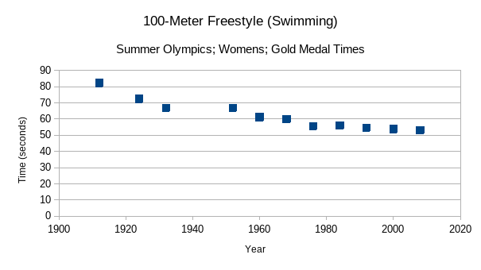
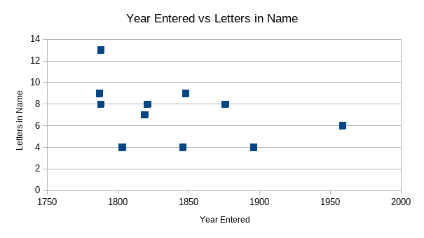

# 	Skyler MacDougall

## Homework 3: Due Friday 6/5/2020

### STAT-145-02

70. [Table 12.22](https://openstax.org/books/introductory-statistics/pages/12-homework#id9978lok311) gives the gold medal times for every other Summer Olympics for the women’s 100-meter freestyle (swimming).

1. Decide which variable should be the independent variable and which should be the dependent variable.
    The year is independent, and the time in seconds is dependent.

1. Draw a scatter plot of the data.
    

2. Does it appear from inspection that there is a relationship between the variables? Why or why not?
    It appears that there is a relationship between the variables, because the points look fairly linear.

3. Calculate the least squares line. Put the equation in the form of: *ŷ* = *a* + *bx*.
    $$
    \hat{y}=603.4304-0.2756x
    $$

4. Find the correlation coefficient. Is the decrease in times significant?
    The decrease in times in significant, because the correlation coefficient is $-0.98861$

5. Find the estimated gold medal time for 1932. Find the estimated time for 1984.
    The time for 1932 should be about 71.0 seconds, and the time for 1984 should be 56.6.

6. Why are the answers from part f different from the chart values?
    The values are incorrect because the linear regression does not perfectly line up with the actual data points.

7. Does it appear that a line is the best way to fit the data? Why or why not?
    It looks like, given only the information here, it would be the best way to fit the data, because of the high correlation coefficient. However, intution about how the human body works suggests that for extrapolation may be better aided by an exponential regression line.

8. Use the least-squares line to estimate the gold medal time for the  next Summer Olympics. Do you think that your answer is reasonable? Why  or why not?
    The least-squares line estimates that the next Summer Olympics time to be 48.9 seconds. That does not seem reasonable, because the data appears to plateau.

**Table 12.22**

| Year | Time (seconds) |
| ---- | -------------- |
| 1912 | 82.2           |
| 1924 | 72.4           |
| 1932 | 66.8           |
| 1952 | 66.8           |
| 1960 | 61.2           |
| 1968 | 60.0           |
| 1976 | 55.65          |
| 1984 | 55.92          |
| 1992 | 54.64          |
| 2000 | 53.8           |
| 2008 | 53.1           |

---

71. We are interested in whether or not the number of letters in a state name depends upon the year the state entered the Union.
    1. Decide which variable should be the independent variable and which should be the dependent variable.
        Number of letters should be the dependent variable, and the year the state entered the Union should be the dependent variable
    
    2. Draw a scatter plot of the data.
        
    
    3. Does it appear from inspection that there is a relationship between the variables? Why or why not?
        No. There is no one particular line here, its more a cloud.
    
    4. Calculate the least-squares line. Put the equation in the form of: *ŷ* = *a* + *bx*.
        $$
        \hat{y}=47.03416-0.02162x
        $$
    
    5. Find the correlation coefficient. What does it imply about the significance of the relationship?
        The correlation coefficient is -0.46054. This implies that the relationship is statistically insignificant.
    
    6. Find the estimated number of letters (to the nearest integer) a  state would have if it entered the Union in 1900. Find the estimated  number of letters a state would have if it entered the Union in 1940.
        The estimated number of letters in a states name would be 6 in 1900, and 5 in 1940.
    
    7. Does it appear that a line is the best way to fit the data? Why or why not?
        This line is not the best way to fit this data. There is no correlation between the length of name and the time the states entered the Union.
    
    8. Use the least-squares line to estimate the number of letters a new  state that enters the Union this year would have. Can the least squares  line be used to predict it? Why or why not?
        The least squares line predicted that if a state joined this year, it would have 3 letters in its name. This method cannot be used to predict it because there is no relationship in the first place.

**Table 12.23**

| State          | # letters in name | Year entered the Union | Rank for entering the Union | Area (square miles) |
| -------------- | ----------------- | ---------------------- | --------------------------- | ------------------- |
| Alabama        | 7                 | 1819                   | 22                          | 52,423              |
| Colorado       | 8                 | 1876                   | 38                          | 104,100             |
| Hawaii         | 6                 | 1959                   | 50                          | 10,932              |
| Iowa           | 4                 | 1846                   | 29                          | 56,276              |
| Maryland       | 8                 | 1788                   | 7                           | 12,407              |
| Missouri       | 8                 | 1821                   | 24                          | 69,709              |
| New Jersey     | 9                 | 1787                   | 3                           | 8,722               |
| Ohio           | 4                 | 1803                   | 17                          | 44,828              |
| South Carolina | 13                | 1788                   | 8                           | 32,008              |
| Utah           | 4                 | 1896                   | 45                          | 84,904              |
| Wisconsin      | 9                 | 1848                   | 30                          | 65,499              |