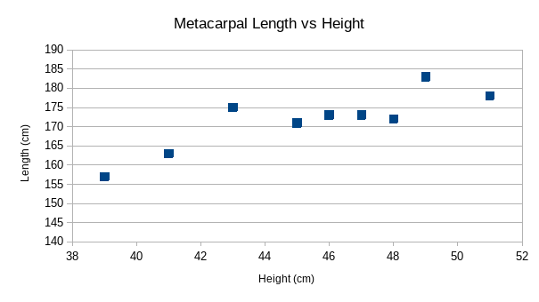

# Question 12

## Anthropological Remains

A. 

B. Using technology, compute the correlation between metacarpal length and  height. Paste the output into the document. Using the scatterplot and  correlation value, describe the strength and direction of the linear  relationship. Be sure to write in the context of the problem.

The r^2^ value is 0.73, which says that the data is somewhat strongly correlated. It also says that the metacarpal is dependent on the height, in this setup. 

# Question 13

## Anthropological Remains

A. Using the least squares equation constructed in the previous problem, interpret the slope of the line on the separate document.

For every centimeter of growth in the metacarpal, the height grows 1.7cm.

B. Using the equation, what height would we predict for a metacarpal  length of 43 cm? Show your work (or Minitab output). Clearly state your  answer on the separate document.
$$
y=1.7x+94.4\\
y=1.7(43cm)+94.4\\
y=167cm
$$

C. Calculate the residual for a metacarpal length of 43 cm. Show your work on the document.

$$
e=175cm-167cm\\
e=8cm
$$

# Question 17

## Grinfield Service Company

A. On the separate document, consider the relationship between  R-squared and the correlation value and calculate the correlation value. Using this correlation value, describe the strength and direction of  the linear relationship in a complete sentence and in the context of the problem.

Generally, R and R^2^ are roughly equal. So, the correlation value should be around 0.6. A linear relation could work for this, although whether it is statistically significant is questionable.

B. On the separate document, interpret the slope of the line in the context of the problem.

For every dollar of  advertizing spent, the amount of weekly sales goes up by $5.96

C. On the separate document, interpret the coefficient of determination (R-squared) in the context of the problem.

The coefficient of determination is 0.6162, which says that a linear regression is a decent model for this system, although it is not the best.