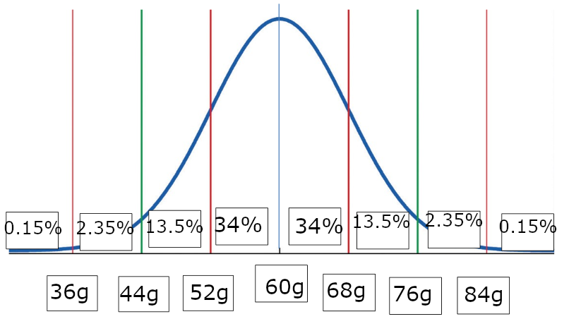
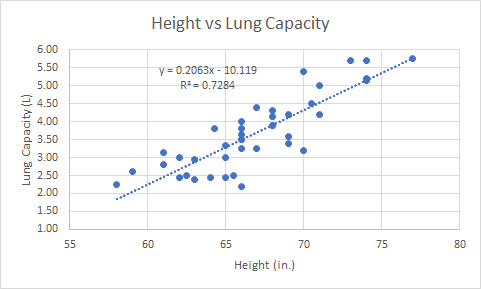
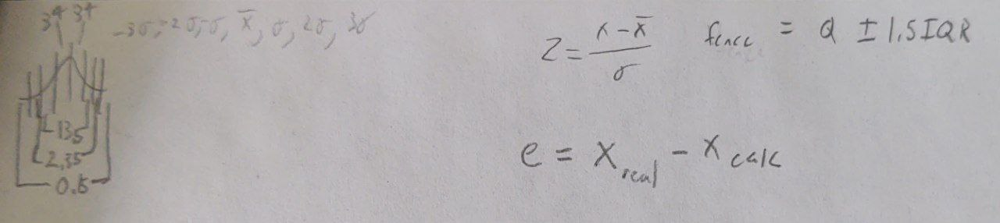

On my honor, as a Rochester Institute of Technology student, I have neither given nor received unauthorized assistance in taking this exam. I have not looked up methods or ideas during the course of the exam. Typing your name here acknowledges agreement with this statement.

Skyler MacDougall

# Problem 1

1.  Draw a picture of the empirical rule for this data - **label the weights and percentages.**
    
2.  What percentage of carrots do you expect would weigh between 44g and 60g?
    47.5%
3.  What weight of carrot represents the 16th percentile?
    68g
4.  Interpret the 16th percentile in a complete sentence, and in the context of the problem.
    The 16th percentile says that 16% of carrots weigh more than 68g.
5.  A recent harvest found numerous carrots to weigh 38g. Is this weight considered unusual for this sample? Explain.
    This weight is not unusual, because it is within $3\sigma$ of the median.
6.  What percentage of carrots do you expect to weigh less than 68g?
    84%

# Problem 2

1.  Indicate which variable is the response variable.
    Lung capacity is the response variable.

2.  Using technology, construct a scatterplot, and paste the graph here.
    

3.  Using technology, report the correlation value of these data.
    $0.853$

4.  Interpret the correlation value in the context of the problem. Be sure to indicate the strength and direction of the linear relationship.
    The correlation value indicates a strong, positive correlation between the height of an individual, and their lung capacity.

5.  Provide the equation of the regression line for these data or paste the output.
    $$
    y=-10.119+0.2063x
    $$

    (see question 2 image)

6.  Interpret the slope of this line, in the context of the problem and in a complete sentence.
    for every inch gained in height, an individual gains 0.2063L in lung capacity.

7.  Using technology, report the coefficient of determination, $R^2$ for these data.
    $$
    R^2=0.7284
    $$
    (see question 2)

8.  Interpret the coefficient of determination in the context of the problem.
    The coefficient of determination shows that a linear correlation is a good match for the spread of the data.

9.  Calculate the residual for an individual with a height of 61 inches. Show your work.
    $$
    y=-10.119+0.2063x\\
    y=-10.119+0.2063*(61in)\\
    y=2.468L\\
    e=2.8L-2.468L\\
    e=0.332
    $$

10.  A residual plot was produced using these data. Based on the plot in the document, do you believe a linear model is a valid model for these data? Give some justification using the residual plot.
     A linear model is a valid model for these data, because the residual plot has values on both sides of the zero line, with residual values generally within 1.

# Problem 3

1.  Based on the comparative box plots, do smokers or non-smokers have the higher lung capacity, on average? Explain how you know.
    Non-smokers, because their IQR is higher than the smokers.
2.  Based on the comparative box plots, your colleague states that the spread of the lung capacity data appears approximately the same for both smokers and non-smokers. Do you agree? Explain.
    The spread is not the same for smokers and nonsmokers, because the non-smokers spread is much more centered than the smokers.

# Problem 4

1.  Using these data, calculate the following summary statistics and fill in the table to 3 decimal places.

    | Mean | Std. Dev. | Min. | Q1    | Median | Q3    | Max  | IQR   |
    | ---- | --------- | ---- | ----- | ------ | ----- | ---- | ----- |
    | 3.73 | 1.044     | 2.25 | 2.963 | 3.625  | 4.375 | 5.75 | 1.413 |

2.  Find the lower and upper outlier fences for the non-smoker lung capacity data. [Show your work or paste technology output.] Interpret the lower and upper outlier fences in a complete sentence.
    $$
    Fence=Q_{1/3}\pm1.5*IQR\\
    LF=Q1-1.5*IQR;\ UF=Q3+1.5*IQR\\
    LF=2.963-1.5*1.413;\ UF=4.375+1.5*1.413\\
    LF=2.963-5.4375;\ UF=4.375+5.4375\\
    \overline{\underline{|LF=-2.475;\ UF=9.813|}}
    $$

3.  What would you report as a typical lung capacity for this sample of non-smokers? Explain why you chose this value.
    I would choose between 2.68 and 4.77, because that is where 68% of data lies. 

4.  Calculate and interpret the z-score for a patient with a lung capacity of 5 liters. [Show your work]
    $$
    Z={x-\overline{x}\over \sigma}\\
    Z={5L-3.73L\over 1.044}\\
    Z=1.218
    $$

This z-score indicates that the patient has a lung capacity 1.218 standard deviations higher than the average.

If your program of study requires it, would you be interested in taking Intro to Statistics II ==online==, were it offered? [Note, it is not currently offered online.]

No.

Insert an image of your cheat sheet here:

