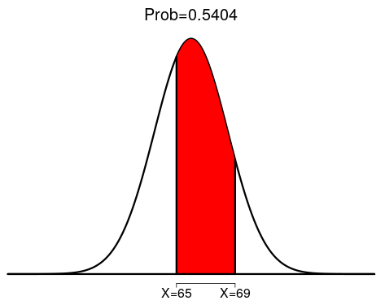
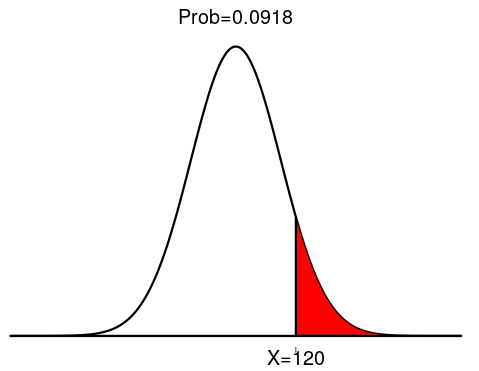
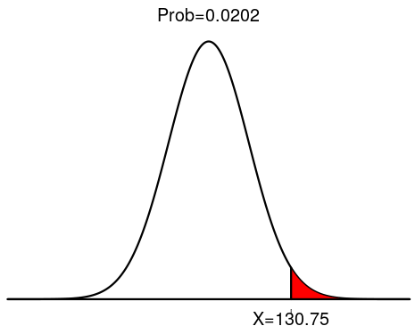
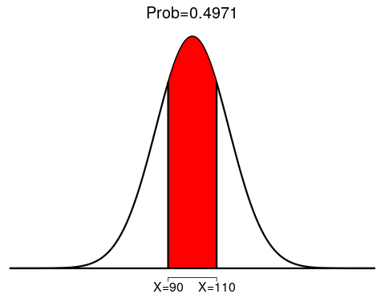
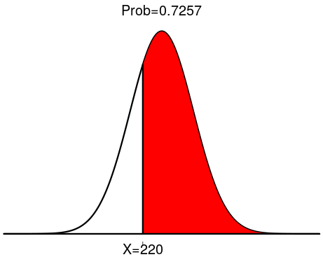
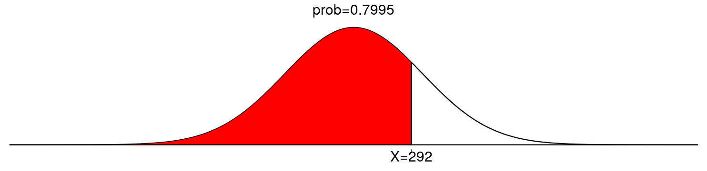
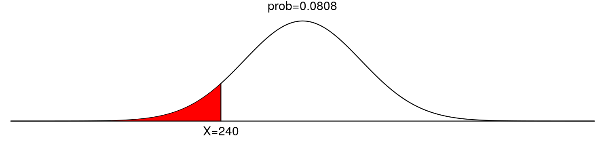
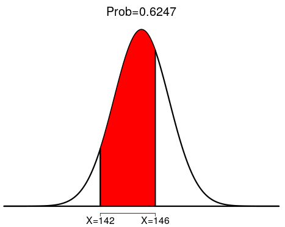

# 	Skyler MacDougall

## Homework 5: Due Friday 6/19/2020

### STAT-145-02

#### Chapter 6 Homework

73. According to a survey done by De Anza students, the height of Asian adult males is normally distributed with an average of 66" and a standard deviation 2.5". Suppose one asian adult male is randomly chosen. Let X=height of the individual.
    1. $X\tilde{}1(66",2.5")$
    2. Find the probability that the person is between 65 and 69". Include a sketch of the graph, and write a probability statement.
        
        There is a 54% chance that the person is between 65 and 69".
    3. Would you expect to meet many Asian adult males over 72"? Explain why or why not, and justify your answer numerically.
        No, I would not. The probability of an Asian adult male being over 72" is 0.82%, which is not likely because it is under 5%.
74. IQ is normally distributed with a mean of 100 and a standard deviation of 15. Suppose one individual is randomly chosen. Let X=IQ of an individual.
    1. $X\tilde{}1(100,15)$
    2. Find the probability that the person has an IQ greater than 120. Include a sketch of the graph, and write a probability statement.
        
        There is a 9.18% chance that a person has an IQ above 120.
    3. MENSA is an organization whose members have the top 2% of all IQs. Find the minimum IQ needed to qualify for the MENSA organization. Sketch the graph, and write the probability statement.
        
        The minimum IQ needed to qualify for MENSA is 130.75. 2% of people have an IQ greater than 130.75
    4. The middle 50% of IQs fall between what two values? Sketch the graph and write the probability statement.

50% of IQs fall between 90 and 110

76. Suppose that the distance of fly balls hit to the outfield in baseball is normally distributed with a mean of 250ft and a standard deviation of 50ft.
    1. If $X$ is the average distance in feet for a fly ball, then $X\tilde{}1(250',50')$
    2. What is the probability that the ball traveled fewer than 220ft? Sketch the graph. Scale the horizontal axis for $\overline X$. Shade the region corresponding to the probability. Find the probability.
        
    3. Find the 80th percentile of the distribution of fly balls. Sketch the graph, and write the probability statement.

80% of fly balls travel less than 292 feet.

80. Terri Vogel, an amateur motorcycle racer, averages 129.71 seconds per 2.5 mile lap in a seven-lap race with a standard deviation of 2.28 seconds. The distribution of her race times is normally distributed. We are interested in one of her randomly selected laps.
    1. In words, define the random variable X.
        X is the number of seconds in a 2.5 mile lap.
    2. $X\tilde{}1(129.71\ seconds, 2.28\ seconds)$
    3. Find the percent of her laps that are completed in less than 130 seconds.
        55.17%
    4. The fastest 3% of her laps are under _ 125.42 seconds _?
    5. The middle 80% of her laps are from _ 126.79 _ seconds to _ 132.63 _ seconds.

#### Chapter 7 Homework

62. Suppose that the distance of fly balls hit to the outfield in baseball is normally distributed with a mean of 250ft and a standard deviation of 50ft. We randomly sample 49 fly balls.
    1. If $\overline X$ is the average distance in feet for 49 fly balls, then $\overline X\tilde{} 49(250',50')$
    2. What is the probability that the 49 balls traveled an average of less than 240ft? Sketch the graph. Scale the horizontal axis for $\overline X$. Shade the region corresponding to the probability. Find the probability.
        
    3. Find the 80th percentile of the distribution of the average of 49 fly balls.
        The 80th percentile of the distribution of the average of 49 fly balls is 244 feet.

64. Suppose that a category of world class runners are known to run a marathon (26 miles) in an average of 145 minutes with a standard deviation of 14 minutes. Consider 49 of the races. Let $\overline X$ the average of the 49 races.
    1. $\overline X\tilde{}49(145\ minutes,\ 14 minutes)$
    2. Find the probability that the runner will average between 142 and 146 minutes in these 49 marathons.
        
    3. Find the median of the average running times.
        Because it is a normal distribution, the mean and the median are the same. Thus, the median is 145 minutes.

96. A typical adult has an average IQ score of 105 with a standard deviation of 20. If 20 randomly selected adults are given an IQ test, what is the probability that the sample mean scores will be between 85 and 125 points?
    The sample mean scores have essentially a 100% chance of being between 85 and 125 points.