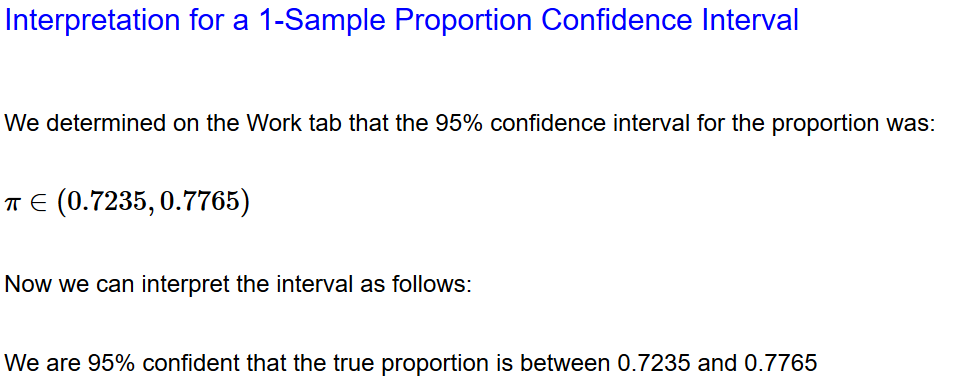
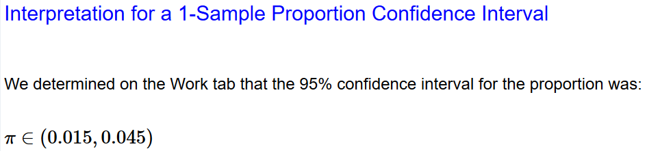
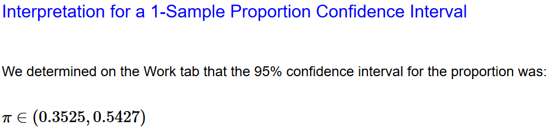

# Question 6

In a USA Today/Gallup Poll, 768 of 1024 randomly selected American  adults (aged 18 or older) state that a candidate’s position on ‘family  values’ is very important in determining their vote for president.

Estimate, with 95% confidence, the proportion of all American adults  that state that a candidate’s position on ‘family values’ is very  important in determining their vote for president.

1.  Pick the multiple-choice response that represents the 95% confidence interval. :ballot_box_with_check:

2.  On a separate document, indicate what technology you used, paste  the output and interpret the confidence interval in the context of the  problem (as demonstrated in the notes).

    

    I used StatHelper.
    I am 95% confident that between 72.35% and 77.65% of American adults find a candidates position on "family values" important.

3.  Show your work as you check if the normality assumption has been met.
    $$
    (n)\hat p(1-\hat p)\ge10\\
    (1024)(0.75)(1-0.75)\ge10\\
    192\ge10
    $$
    This set of data can be considered normal.

# Question 9

I was unable to find how to calculate this in the notes.

# Question 10

See response to question 9.

# Question 11

XYZ Fasteners manufactures three-inch nails. If a nail is not  straight, then it is considered defective. In a recent sample of 500  nails, 15 were determined to be defective.

1.  Estimate, with 95% confidence, the true proportion of three-inch  nails that are defective. Show your technology output and interpret the  interval in the context of the problem.
    
    Between 1.5% and 4.5% of nails are defective.
2.  What is the point estimate for the true proportion of three-inch nails that are defective for this sample?
    $\hat p=3$
3.  What is the margin of error for this interval?
    $ME=1.5$
4.  XYZ Fasteners claims that no more than 3% of the nails it produces are  defective. Does the CI support this statement? Explain your answer. 
    The CI does not support this statement, as the entire CI is not below 3%.
5.  An industry review claims that the defective rate for nail production  is expected to be 2%. Does the CI support this statement? Explain your answer.
    The CI does not support this statement either, as the entire CI is not above 2%.

# Question 12

New York State consumers can purchase non-prescription medications at food stores, mass merchandise stores (such as Walmart), or pharmacies. A recent study asked a random sample of NYS consumers whether they buy  their non-prescription medications at a pharmacy. Of the 105 people  polled, 47 indicated they buy their non-prescription medicines at a  pharmacy.

1.  Estimate, with 95% confidence, the proportion of all NYS consumers that buy their non-prescription medicines at a pharmacy. Interpret the  CI and check if the normality assumption has been met (show work).
    
    $$
    (n)\hat p(1-\hat p)\ge10\\
    (105)(0.4476)(1-0.4476)\ge10\\
    26\ge10
    $$
    Between 35.25% and 54.27% of NYS consumers buy their non-prescription medicines at a pharmacy.

2.  A pharmacy publication stated that at least 40% of NYS  consumers use the pharmacy for non-prescription items. Does the CI  support this statement? Explain.
    The CI does not support this statement, because the entire CI is not above 40%. 

3.  Your colleague wants to report that a **majority** of NYS consumers use the pharmacy for non-prescription items. Does the CI support this statement? Explain.
    The CI does not support this statement either, because the entire CI is not above 50%.

4.  Your department settles on the following statement: 50% of NYS consumers use the pharmacy for non-prescription items. Does the CI  support this statement? Explain.
    The CI does support this statement because 50% is within the CI.