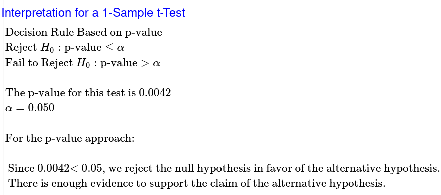
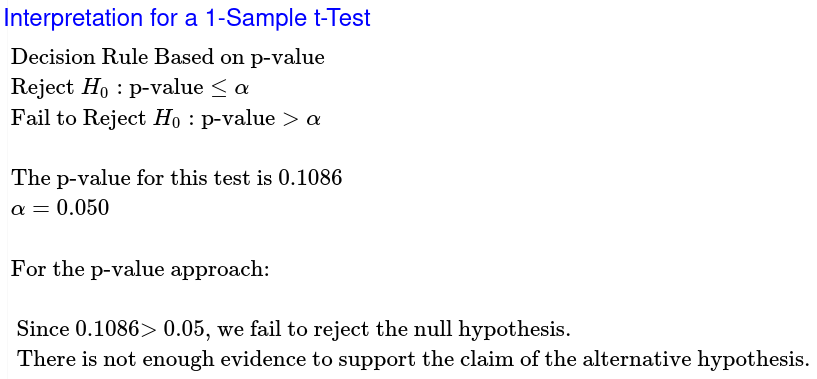
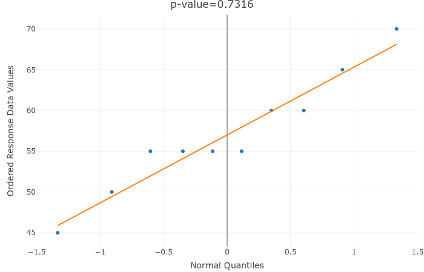

# 	Skyler MacDougall

## Homework 9: Due Friday 7/17/2020

### STAT-145-02

65. Previously, an organization reported that teenagers spent 4.5 hours per  week, on average, on the phone. The organization thinks that, currently, the mean is higher. Fifteen randomly chosen teenagers were asked how  many hours per week they spend on the phone. The sample mean was 4.75  hours with a sample standard deviation of 2.0. Conduct a hypothesis  test. The null and alternative hypotheses are:
    1. $\cancel{H_o:\overline x=4.5, H_a:\overline x>4.5}$
    2. $\cancel{H_o:\mu\ge4.5, H_a:\mu<4.5}$
    3. $\cancel{H_o:\mu=4.75, H_a:\mu>4.75}$
    4. $\overline{\underline{|H_o:\mu=4.5, H_a:\mu>4.5|}}$

79. In 1955, *Life Magazine* reported that the  25 year-old mother of three worked, on average, an 80 hour week.  Recently, many groups have been studying whether or not the women's  movement has, in fact, resulted in an increase in the average work week  for women (combining employment and at-home work). Suppose a study was  done to determine if the mean work week has increased. 81 women were  surveyed with the following results. The sample mean was 83; the sample  standard deviation was ten. Does it appear that the mean work week has  increased for women at the 5% level?  (**Show complete testing process as shown in notes.**)

#### Population

We are studying the amount of time, in hours per week, that a 25-year-old mother of three works, on average.

$\mu$ = true mean working hours per week of all 25-year-old mothers of three.

Goal: Test to see if there is support for saying that $\mu$ has increased from 80.

#### Method

$$
H_0:\mu=80\\
H_a:\mu>80\\
\alpha=0.05\\
T-curve\ with\ df=80
$$

#### Sample

$$
n>30\\
\therefore\\
The\ sample\ can\ be\\
considered\ normal
$$

#### Results

$$
t=\frac{\overline x-u_0}{s\div\sqrt n}\ with\ df=n-1\\
t=\frac{83-80}{\frac{10}{\sqrt{81}}}\ with\ df=81-1\\
t=\frac{3}{\frac{10}{\sqrt{81}}}\ with\ df=80\\
t=2.7\ with\ df=80
$$

My sample mean is 2.7 standard errors above 80.

My p-value is 0.0042.

Assuming that the true mean equals 80, there is a 0.42% probability of getting a sample mean ($\overline x$) at least as extreme as the one we got from sampling.

#### Conclusion

At the 5% level of significance, the sample data does provide sufficient evidence to say that the true mean has increased from 80 work hours per week for 25-year-old mothers of three.

85. The mean work week for engineers in a start-up  company is believed to be about 60 hours. A newly hired engineer hopes  that it’s shorter. She asks ten engineering friends in start-ups for the lengths of their mean work weeks. Based on the results that follow,  should she count on the mean work week to be shorter than 60 hours? (**Show the complete testing process as shown in notes.  Data in the "Work Hours (#85)" sheet in the data file.**)

#### Population

We are studying the amount of time, in hours per week, that engineers work in a start-up company.

$\mu$ = true mean working hours per week of all engineers in the start-up company.

Goal: Test to see if there is support for saying that $\mu$ has decreased from 60.

#### Method

$$
H_0:\mu=60\\
H_a:\mu<60\\
\alpha=0.05\\
T-curve\ with\ df=9
$$

#### Sample

$$
p>0.05\\
\therefore\\
The\ sample\ can\ be\\
considered\ normal
$$

#### Results

$$
t=\frac{\overline x-u_0}{s\div\sqrt n}\ with\ df=n-1\\
t=\frac{57-60}{\frac{7.149}{\sqrt{10}}}\ with\ df=10-1\\
t=\frac{-3}{\frac{7.149}{\sqrt{10}}}\ with\ df=9\\
t=-1.327\ with\ df=9
$$

My sample mean is 1.327 standard errors below 60.

My p-value is 0.1086.

Assuming that the true mean equals 60, there is a 10.86% probability of getting a sample mean ($\overline x$) at least as extreme as the one we got from sampling.

#### Conclusion

At the 5% level of significance, the sample data does not provide sufficient evidence to say that the true mean has decreased from 60 work hours per week for engineers at a start-up company.

