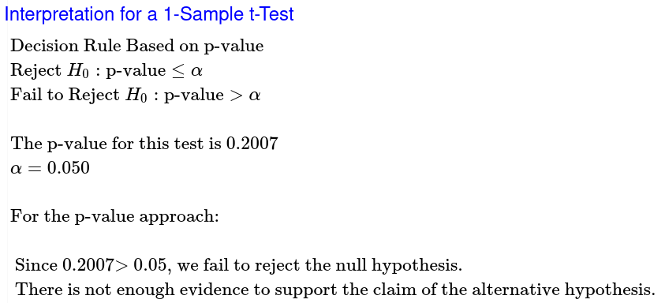
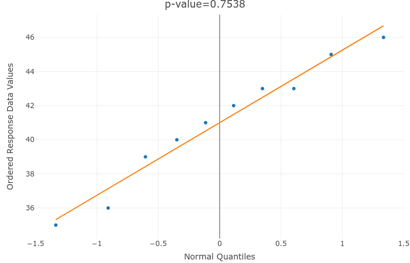
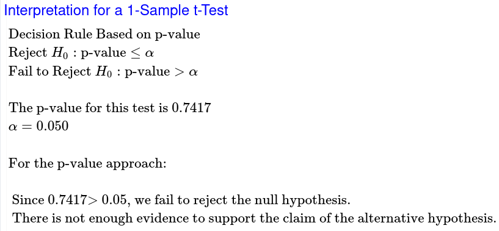

# Question 11

## Tire Company

#### Population

We are studying the lifetime of a tire from one tire company, measured in thousands of miles.

$\mu$ = true mean lifetime of a tire from one tire company.

Goal: Test to see if there is support for saying that $\mu$ has decreased from 42.

#### Method

$$
H_0:\mu=42\\
H_a:\mu<42\\
\alpha=0.05\\
T-curve\ with\ df=9
$$

#### Sample

$$
p>0.05\\
\therefore\\
The\ sample\ can\ be\\
considered\ normal
$$

#### Results

$$
t=\frac{\overline x-u_0}{s\div\sqrt n}\ with\ df=n-1\\
t=\frac{41-42}{\frac{3.59}{\sqrt{10}}}\ with\ df=10-1\\
t=\frac{-1}{\frac{3.59}{\sqrt{10}}}\ with\ df=9\\
t=-0.8808\ with\ df=9
$$

My sample mean is 0.8808 standard errors below 42.

My p-value is 0.2007.

Assuming that the true mean equals 80, there is 20.07% probability of getting a sample mean ($\overline x$) at least as extreme as the one we got from sampling.

#### Conclusion

At the 5% level of significance, the sample data does not provide sufficient evidence to say that the true mean has decreased from 42 thousand miles for the lifetime of a tire from one tire company.

# Question 12

## US Pennies

#### Population

We are studying the weight, in grams, of US pennies.

$\mu$ = true mean weight of all US pennies in grams.

Goal: Test to see if there is support for saying that $\mu$ has changed from 2.5.

#### Method

$$
H_0:\mu=2.5\\
H_a:\mu\ne2.5\\
\alpha=0.05\\
T-curve\ with\ df=36
$$

#### Sample

$$
n>30\\
\therefore\\
The\ sample\ can\ be\\
considered\ normal
$$

#### Results

$$
t=\frac{\overline x-u_0}{s\div\sqrt n}\ with\ df=n-1\\
t=\frac{2.499-2.5}{\frac{0.0165}{\sqrt{37}}}\ with\ df=37-1\\
t=\frac{0.0009}{\frac{0.0165}{\sqrt{37}}}\ with\ df=36\\
t=-0.3322\ with\ df=36
$$

My sample mean is 0.3322 standard errors below 2.5.

My p-value is 0.7417.

Assuming that the true mean equals 2.5, there is a 74.17% probability of getting a sample mean ($\overline x$) at least as extreme as the one we got from sampling.

#### Conclusion

At the 5% level of significance, the sample data does not provide sufficient evidence to say that the true mean has changed from 2.5 grams for the weight of a US penny.

